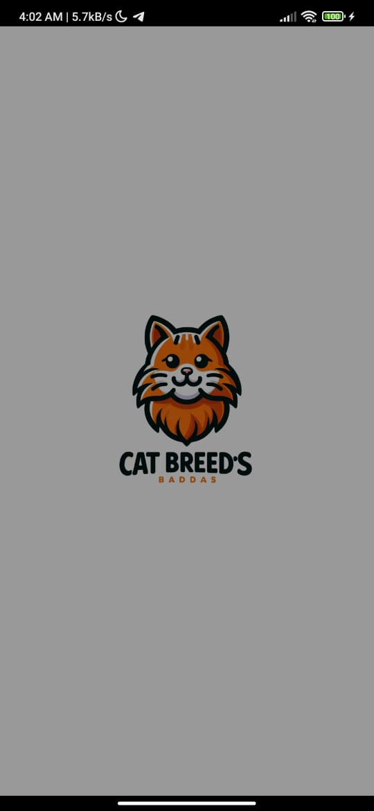
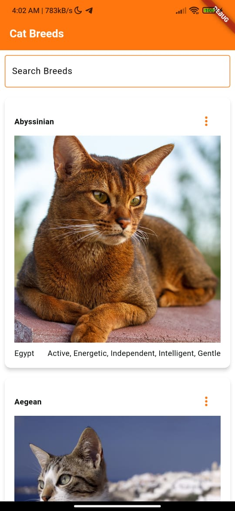
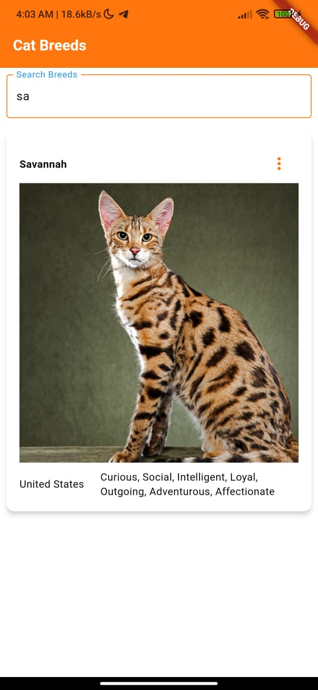
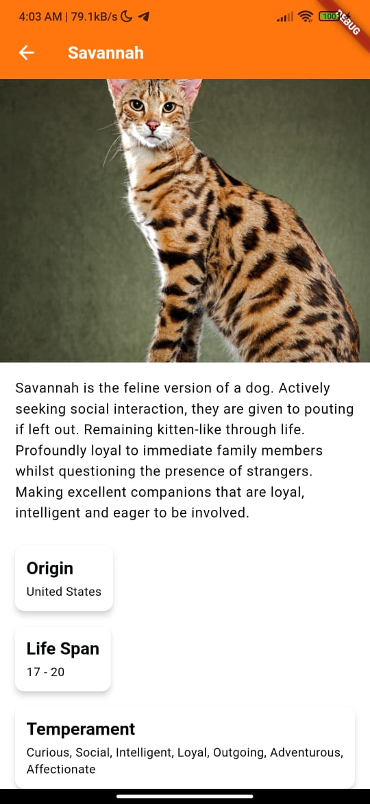

# cat_breeds_ap

Cat Breeds App es una aplicación Flutter que muestra una lista de razas de gatos junto con información detallada sobre cada raza. La aplicación obtiene datos de The Cat API y los presenta en una interfaz limpia y moderna.

## Características
- Búsqueda de razas de gatos en tiempo real.
- Ver información detallada sobre cada raza.
- Mostrar imágenes de gatos e información de razas en un formato estructurado.
- Página de detalles de raza desplazable con encabezado de imagen fija.

## Capturas de Pantalla

### Pantalla de Splash

### Pantalla Principal

### Pantalla de Búsqueda

### Pantalla de Detalles de la Raza

## Arquitectura

La Cat Breeds App sigue una arquitectura simple pero efectiva para asegurar escalabilidad y mantenibilidad:

- **Gestión de Estado**: La aplicación utiliza Bloc para la gestión del estado, separando la lógica de negocio de la interfaz de usuario.
- **Patrón Repository**: El repositorio maneja las llamadas a la API y la recuperación de datos, facilitando su gestión y prueba.
- **Interfaz de Usuario**: La interfaz de usuario está construida utilizando el sistema de widgets moderno y flexible de Flutter, proporcionando una experiencia de usuario fluida y receptiva.

### Estructura de Carpetas

├── lib
│ ├── cubit
│ │ └── cat_cubit.dart
│ ├── models
│ │ └── breed.dart
│ ├── pages
│ │ ├── cat_page.dart
│ │ └── breed_detail_page.dart
│ ├── repository
│ │ └── cat_repository.dart
│ └── main.dart

